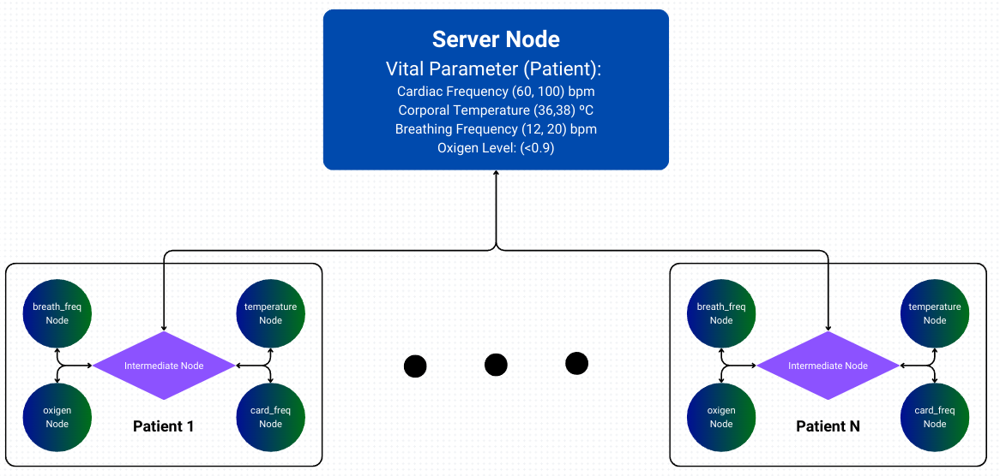

# Wireless Networks
[](https://github.com/jpvt/wireless-networks/blob/main/LICENSE)
[](https://www.linkedin.com/in/jpvt/)
[](README_ptbr.md)

Repository dedicated to the Wireless Networks course took at the Federal University of Paraíba. On this class, we created experiments using ns-3. The project's structure is based on [Alejandro Gomez's Network Simulator](https://github.com/alejandrogomez314/network-simulator). The experiments are implemented in the scenarios directory, where each scenario has it's own docker-compose file to setup the necessary containers and volumes. The simulations can be run using scripts that sets up th required linux networking interfaceson host and connects them to the running containers and simulation.

## Table of Contents
- [Wireless Networks](#wireless-networks)
  - [Table of Contents](#table-of-contents)
  - [Requeriments](#requeriments)
  - [Installation](#installation)
  - [Scenarios](#scenarios)
    - [Hello World](#hello-world)
    - [Smart Hospital](#smart-hospital)
      - [**Nodes**](#nodes)
      - [**Server Data**](#server-data)
      - [**Files**](#files)
      - [**Running the scenario**](#running-the-scenario)

## Requeriments

1. Linux or MacOS
   
   :warning: Warning: This installation was only tested on `Linux` (but should work fine for `MacOS` as well).

2. `docker` -  https://docs.docker.com/get-docker/

3. `docker compose` -  https://docs.docker.com/compose/install/

4. `git` installed by your distribution Linux or macOS (e.g. `HomeBrew`)

## Installation

1. Install [`docker`](https://docs.docker.com/get-docker/) and verify installation. Should be possible to run the `hello-world` image:

    ```console
    foor@bar# sudo docker run hello-world

    Hello from Docker!
    This message shows that your installation appears to be working correctly.

    To generate this message, Docker took the following steps:
    1. The Docker client contacted the Docker daemon.
    2. The Docker daemon pulled the "hello-world" image from the Docker Hub.
        (amd64)
    3. The Docker daemon created a new container from that image which runs the
        executable that produces the output you are currently reading.
    4. The Docker daemon streamed that output to the Docker client, which sent it
        to your terminal.

    To try something more ambitious, you can run an Ubuntu container with:
    $ docker run -it ubuntu bash

    Share images, automate workflows, and more with a free Docker ID:
    https://hub.docker.com/

    For more examples and ideas, visit:
    https://docs.docker.com/get-started/
    ```

2. Clone the repo. Example using SSH:

    ```console
    foo@bar# git clone git@github.com:jpvt/wireless-networks.git
    ```

3. Prepare the `hello_world.sh` script to run:

    ```console
    foo@bar# chmod a+x scripts/hello_world.sh
    ```

4. Run the `hello_world.sh`  script:

    :warning: Warning: On the first run this should take about ~22 minutes on a 300Mbps connection.

    ```console
    foo@bar# ./scripts/hello_world.sh

    ns3  | -- Configuring done
    ns3  | -- Generating done
    ns3  | -- Build files have been written to: /usr/local/ns-allinone-3.37/ns-3.37/cmake-cache
    ns3  | Scanning dependencies of target scratch_hello
    ns3  | [  0%] Building CXX object scratch/CMakeFiles/scratch_hello.dir/hello.cc.o
    ns3  | [  0%] Linking CXX executable ../../build/scratch/ns3.37-hello-default
    ns3  | At time +2s client sent 1024 bytes to 10.1.1.2 port 9
    ns3  | At time +2.00369s server received 1024 bytes from 10.1.1.1 port 49153
    ns3  | At time +2.00369s server sent 1024 bytes to 10.1.1.1 port 49153
    ns3  | At time +2.00737s client received 1024 bytes from 10.1.1.2 port 9
    ns3 exited with code 0
    Done
    ```

## Scenarios

### Hello World

This is a test scenario to check if your setup is working properly. There is not much to it. Files in this scenario:

- script: `hello_world.sh`
- docker compose: `scenarios/hello-world.yaml`
- src file: `hello.cc`
- image: `ns3.Dockerfile`

### Smart Hospital

In this scenario, a smart hospital is equipped with an Internet of Things (IoT) network to continuously monitor patients' vital parameters and respond to events in real-time to improve patient care quality.


*Note: the intervals of vital parameters may change accordingly to the patient data.*

#### **Nodes**

1. **Sensor Nodes:** These nodes are associated with patients and are responsible for continuously monitoring patients' vital parameters, such as heart rate, blood pressure, body temperature, respiratory rate, and blood oxygen levels.

2. **Server Node:** This node receives readings from the sensor nodes. It has predefined rules to identify normal and abnormal readings. When an abnormal reading is detected, the server node identifies this as an event.

3. **Actuator Nodes:** These nodes are associated with various actions that may be required in response to an event. For example, there might be an actuator node associated with a robot that delivers medications to patients.

4. **Intermediate Nodes:** These nodes facilitate communication between the sensor nodes, the server node, and the actuator nodes.

#### **Server Data**

The server node stores and processes the patients' vital parameters, which are continuously monitored by the sensor nodes. This includes patients' heart rate, blood pressure, body temperature, respiratory rate, and blood oxygen levels.

#### **Files**

- script: `hospital.sh`
- docker compose: `scenarios/hospital.yaml`
- src file: `hospital.cc`
- logs: `data/hospital_logs.txt`
- server data: `data/patients_data.csv`
- test input: `data/sensor_readings.csv`
- image: `ns3.Dockerfile` 

#### **Running the scenario**

1. Prepare the `hospital.sh` script to run:

    ```console
    foo@bar# chmod a+x scripts/hospital.sh
    ```

2. Run the `hospital.sh`  script:

    :warning: Warning: If this is the first time that you're building the image, this should take about ~22 minutes on a 300Mbps connection.

    ```console
    foo@bar# ./scripts/hospital.sh
    ```